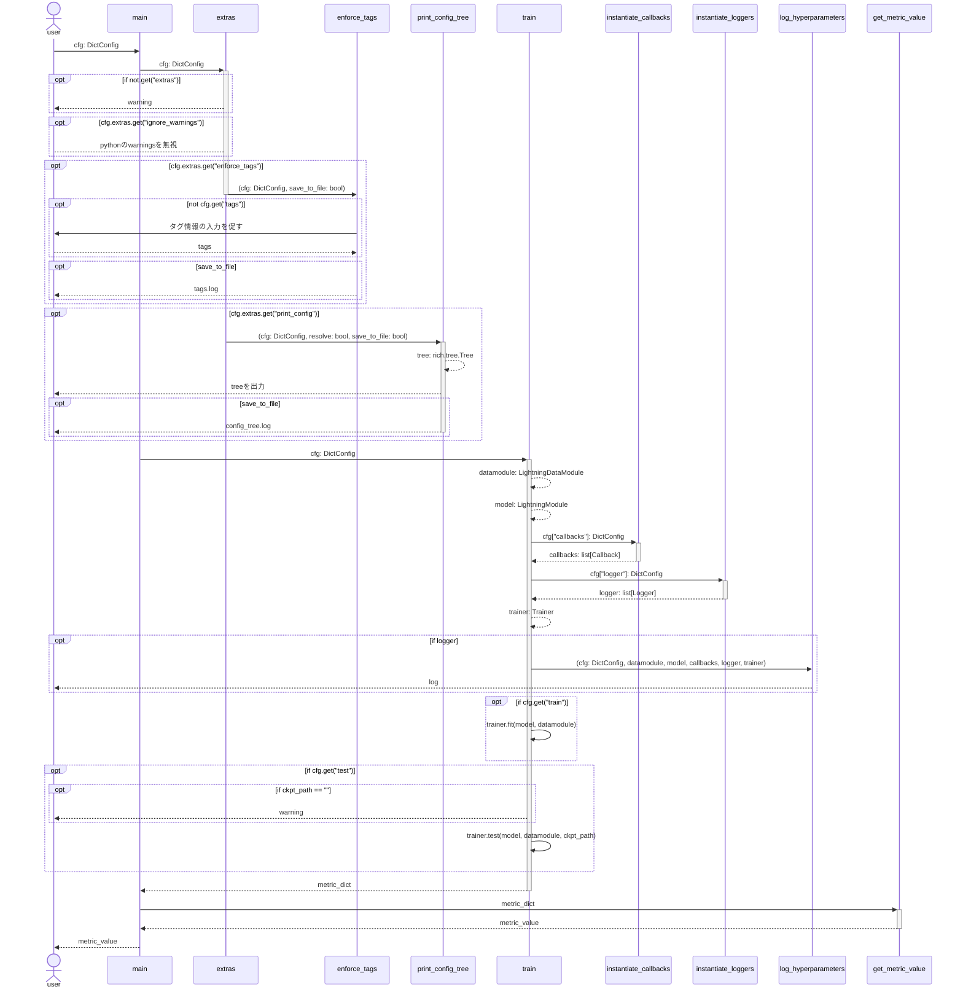

# モダンな深層学習モデルの開発環境
PyTorch LightningとHydraを組み合わせて、機械学習プロジェクトの開発効率化を図る。

## 使用技術
uv, MLFlow, PyTorch Lightning, Hydra, mypy, ruff

- config
    - extras:
        ignore_warnings: Pythonのwarningsを無視するかどうか
        enforce_tags: コマンドラインからタグを設定するかどうか
        print_config:　RichでConfig Tree(設定ツリー)を出力するかどうか

